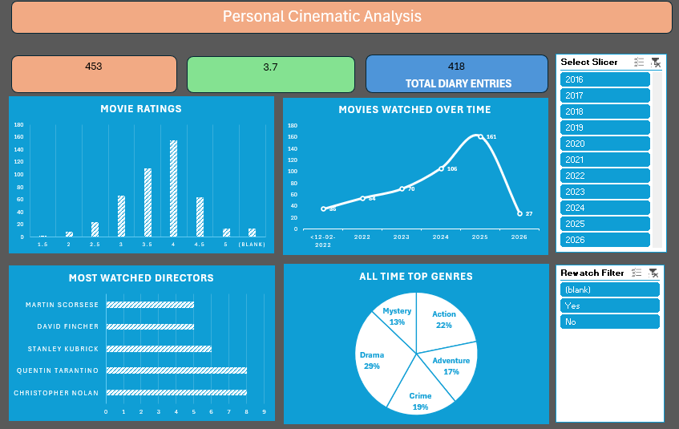

# 🎬 Personal Cinematic Analysis Dashboard

An end-to-end data analytics project transforming raw movie logs into a professional-grade interactive dashboard. This project demonstrates advanced **Excel Data Modeling**, **Power Query (M)** ETL processes, and **UI/UX** design principles for personal data storytelling.



---

## 🚀 Key Features

* **Dynamic KPI Scorecards:** Real-time calculation of total films, average ratings, and diary entries using linked shape-to-cell references.
* **Genre Normalization:** Custom ETL logic to handle multi-genre strings (e.g., "Action, Sci-Fi" → "Action" & "Sci-Fi"), ensuring accurate frequency analysis across the entire dataset.
* **Targeted Interactivity:** Integrated slicers optimized for deep-diving into **Rating Distributions** and yearly volume filters.
* **Timeline Visualization:** High-level "Viewing Velocity" chart displaying year-over-year consumption trends.
* **Modern UI/UX:** High-contrast Dark Mode aesthetic with a focus on visual hierarchy and clean data labels.

---

## 🛠️ Technical Stack & Process

### 1. Data Extraction & Cleaning (Power Query)
The raw Letterboxd CSV contained "dirty" entries and multi-valued attributes that required normalization.
* **The Problem:** Genres were exported as comma-separated strings (e.g., "Drama, Mystery"), which standard PivotTables cannot aggregate individually.
* **The Solution:** Implemented **Split Column by Delimiter (Rows)** and **Unpivot** techniques to create a normalized "Genre Dimension" table for the Top Genre analysis.
* **Cleaning:** Handled `(blank)` entries and utilized **Trim/Clean** functions to remove hidden spaces from the dataset.

### 2. Data Modeling & Interactivity
Established a relational structure to ensure performance and specific data views.
* **Slicer Logic:** Designed the **Year** and **Rewatch** slicers to dynamically filter the **Movie Ratings** and KPI metrics, allowing for a focused analysis of taste and volume over specific timeframes.
* **Bridge Cells:** Created a calculation layer to feed dynamic values into the Dashboard KPI shapes based on filtered results.

### 3. Visualizations
* **Timeline Chart:** Analyzed viewing habits over time with smoothed line vectors for professional presentation.
* **Doughnut Chart:** Comprehensive breakdown of all-time top genres after normalization.
* **Bar Charts:** Ranking most-watched directors and visualizing the distribution of user ratings (1.5 to 5.0 stars).

---

## 📅 Future Roadmap
* **Drill-down Capabilities:** Implementing Month-level granularity for the timeline chart to analyze seasonal watching habits.
* **Enhanced Interactivity:** Expanding Slicer Report Connections to include Director and Genre charts via the Excel Data Model.

---

## 📂 Project Structure

```text
├── Data/
│   └── Raw_Letterboxd_Data.csv      # Original CSV export
├── Dashboard/
│   └── Cinematic_Analysis.xlsx     # Final interactive Excel file
├── Images/
│   ├── Dashboard_Full_Preview.png  # High-res screenshot
│   └── Dashboard_Demo.gif          # Slicer interaction recording
└── README.md                       # Documentation
